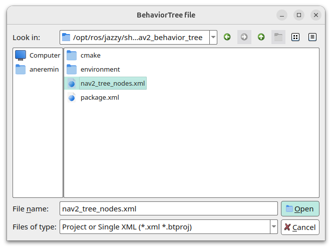

# Robot Behavior

## Оглавление
- [Построение дерева поведения](#построение-дерева-поведения)
  - [Выполнение последовательности действий](#выполнение-последовательности-действий)
  - [Построение дерева для навигации](#построение-дерева-для-навигации)
  - [Переключение планировщиков](#переключение-планировщиков)
- [Настройка дерева поведения через графический интерфейс](#настройка-дерева-поведения-через-графический-интерфейс)
  - [Загрузка управляющих, выполняющих узлов и условий из Nav2](#загрузка-управляющих-выполняющих-узлов-и-условий-из-nav2)
- [Запуск!](#запуск)

## Построение дерева поведения

> Список узлов дерева поведения Nav2 представлен на [официальной странице проекта](https://docs.nav2.org/configuration/packages/configuring-bt-xml.html).

Выполним создание и запуск простого дерева поведения. Для этого проекте *bmx_navigation* в папке *config* создадим директорию **nav2_bt_navigator**, где будем хранить наши деревья поведения в формате XML.

Создадим в созданной папке файл **drive_on_heading.xml**. Укажем в нем корневой узел *root* и общий узел *BehaviorTree*.

```xml
<root main_tree_to_execute="MainTree">
  <BehaviorTree ID="MainTree">

  </BehaviorTree>
</root>
```

Укажем, что роботу необходимо проехать вперед 1 метр. Для этого будем использовать действие *DriveOnHeading*.

```xml
<root main_tree_to_execute="MainTree">
  <BehaviorTree ID="MainTree">
    <DriveOnHeading dist_to_travel="1.0" speed="0.2" server_name="drive_on_heading" server_timeout="10"/>
  </BehaviorTree>
</root>
```

В YAML-файле конфигурации Nav2 укажем путь до файла дерева поведения. Для этого добавим параметр *default_nav_to_pose_bt_xml* в параметры ROS узла *bt_navigator*.

```yaml
bt_navigator:
  ros__parameters:
    ...
    default_nav_to_pose_bt_xml: $(find-pkg-share bmx_navigation)/config/nav2_bt_navigator/drive_on_heading.xml
```

Также добавим плагин для работы действия в параметры *behavior_server*.

```yaml
behavior_server:
  ros__parameters:
    ...
    behavior_plugins: ["spin", "backup", "wait", "drive_on_heading"]
    drive_on_heading:
        plugin: nav2_behaviors::DriveOnHeading
    ...
```

### Выполнение последовательности действий

Выполним построение дерева поведения для движения робота вперед и назад. Для этого в *config/nav2_bt_navigator* создадим файл **forward_backward_motion.xml**. Поскольку будем выполнять два действия, то укажем управляющий узел *Sequence*.

```xml
<root main_tree_to_execute="MainTree">
  <BehaviorTree ID="MainTree">
    <Sequence>
      <DriveOnHeading dist_to_travel="1.0" speed="0.2" server_name="drive_on_heading" server_timeout="10"/>
      <BackUp backup_dist="1.0" backup_speed="0.2" server_name="backup" server_timeout="10"/>
    </Sequence>
  </BehaviorTree>
</root>
```

Укажем в *src/bmx_navigation/config/navigation.yaml* соответствующий путь до файла с деревом поведения.

```yaml
bt_navigator:
  ros__parameters:
    ...
    default_nav_to_pose_bt_xml: $(find-pkg-share bmx_navigation)/config/nav2_bt_navigator/forward_backward_motion.xml
```

### Построение дерева для навигации

Минимальное дерево навигации к целевой позиции включает выполнение последовательности *Sequence*, включающей построение глобального пути *ComputePathToPose* и выполнение локальной навигации к цели *FollowPath*. Для реализации такого поведения создадим файл **navigate_to_pose.xml** и добавим в него следующие элементы:

```xml
<root main_tree_to_execute="MainTree">
  <BehaviorTree ID="MainTree">
    <Sequence name="NavigateWithReplanning">
      <ComputePathToPose goal="{goal}" path="{path}"/>
      <FollowPath path="{path}"/>
    </Sequence>
  </BehaviorTree>
</root>
```

Заменим в YAML-файле конфигурации навигации путь до файла дерева поведения.

```yaml
bt_navigator:
  ros__parameters:
    ...
    default_nav_to_pose_bt_xml: $(find-pkg-share bmx_navigation)/config/nav2_bt_navigator/navigate_to_pose.xml
```

> Соберите проект, запустите робота, навигацию и подайте команду движения до целевой позиции.

Для того, чтобы робот обновлял свой глобальный путь периодически, реализуем конвейерную последовательность  *PipelineSequence*. Чтобы ограничить частоту обновления глобальной карты, будем использовать *RateController*. Обновим наш файл **navigate_to_pose.xml**.

```xml
<root main_tree_to_execute="MainTree">
  <BehaviorTree ID="MainTree">
    <PipelineSequence name="NavigateWithReplanning">
      <RateController hz="1.0">
        <ComputePathToPose goal="{goal}" path="{path}"/>
      </RateController>
      <FollowPath path="{path}"/>
    </PipelineSequence>
  </BehaviorTree>
</root>
```

Теперь добавим в наше дерево учет случая, когда глобальный, либо локальный планировщик выдает ошибку. Для этого будем использовать узел *RecoveryNode*, который в случае возврата последовательностью статуса ошибки будет выполнять операции восстановления. Создадим файл **navigate_to_pose_w_recovery.xml** и добавим узел *RecoveryNode* родительским элементом. Текущую последовательность оставим без изменений, а в случае ошибки будем выполнять очистку карт затрат и движение робота назад на 0.4 м. Общее количество попыток укажем равным 5.

```xml
<root main_tree_to_execute="MainTree">
  <BehaviorTree ID="MainTree">
    <RecoveryNode number_of_retries="5">
      <PipelineSequence name="NavigateWithReplanning">
        <RateController hz="1.0">
          <ComputePathToPose goal="{goal}" path="{path}"/>
        </RateController>
        <FollowPath path="{path}"/>
      </PipelineSequence>
      <Sequence>
        <ClearEntireCostmap service_name="local_costmap/clear_entirely_local_costmap"/>
        <ClearEntireCostmap service_name="global_costmap/clear_entirely_global_costmap"/>
        <BackUp backup_dist="0.4" backup_speed="0.1" server_name="backup" server_timeout="10"/>
      </Sequence>
    </RecoveryNode>
  </BehaviorTree>
</root>
```

> При создании нового файла с деревом поведения необходимо указывать обновленный путь в конфигурационном файле навигации

Теперь зададим попытки построения глобального и локального путей. Для этого будем использовать также узел *RecoveryNode*, и в случае ошибок очищать глобальную/локальную карту затрат в течение 2 попыток. Получим следующее дерево поведения:

```xml
<root main_tree_to_execute="MainTree">
  <BehaviorTree ID="MainTree">
    <RecoveryNode number_of_retries="5">
      <PipelineSequence name="NavigateWithReplanning">
        <RateController hz="1.0">
          <RecoveryNode number_of_retries="2">
            <ComputePathToPose goal="{goal}" path="{path}"/>
            <ClearEntireCostmap service_name="local_costmap/clear_entirely_local_costmap"/>
          </RecoveryNode>
        </RateController>
        <RecoveryNode number_of_retries="2">
          <FollowPath path="{path}"/>
          <ClearEntireCostmap service_name="global_costmap/clear_entirely_global_costmap"/>
        </RecoveryNode>
      </PipelineSequence>
      <Sequence>
        <ClearEntireCostmap service_name="local_costmap/clear_entirely_local_costmap"/>
        <ClearEntireCostmap service_name="global_costmap/clear_entirely_global_costmap"/>
        <BackUp backup_dist="0.4" backup_speed="0.1" server_name="backup" server_timeout="10"/>
      </Sequence>
    </RecoveryNode>
  </BehaviorTree>
</root>
```

### Переключение планировщиков

Одной из важных составляющих навигации является возможность переключения между планировщиками. Это актуально в частности при изменении окружающей обстановки, например в случае перехода из навигации в помещении, где для работы достаточно иметь двумерную карту и соответствующий алгоритм, в навигацию в уличной среде, где нужно строить путь с учетом неровностей покрытия, типа покрытия и проч.

Возьмем ситуацию, в которой роботу необходимо переключиться с одного локального планировщика на другой в случае невозможности построения пути первым планировщиком. Начнем с добавления плагина планировщика в конфигурационный файл навигации *bmx_navigation/config/navigation.yaml*. Обратимся к ветке *controller_server* и укажем в поле **controller_plugins** вместо названия "FollowPath" названия планировщиков, которые будем использовать:

```yaml
controller_server:
    ros__parameters:
    ...
    controller_plugins: ["DWB", "MPPI"]
    ...
```

Для каждого из названий планировщиков необходимо указать параметры, для этого переименуем ключ "FollowPath" в "DWB" и ниже после описания параметров планировщика DWB добавим ключ "MPPI", в котором будем описывать параметры этого локального планировщика.   

```yaml
controller_server:
    ros__parameters:
      ...
      DWB:
        plugin: "dwb_core::DWBLocalPlanner"
        debug_trajectory_details: True
        ...
      MPPI:
        plugin: "nav2_mppi_controller::MPPIController"
```

Опишем добавленный локальный планировщик, указав основные параметры.

```yaml
controller_server:
    ros__parameters:
      ...
      MPPI:
        plugin: "nav2_mppi_controller::MPPIController"
        visualize: true

        # минимальные и максимальные скорости по осям X, Y и оси вращения Z
        vx_max: 0.3
        vx_min: -0.3
        vy_max: 0.3
        wz_max: 1.0

        # минимальные и максимальные значения ускорения и торможения робота
        ax_max: 3.0
        ax_min: -3.0
        ay_max: 0.0
        ay_min: 0.0
        az_max: 3.2

        # параметры для генерации скоростей
        time_steps: 56
        model_dt: 0.05
        batch_size: 2000
        vx_std: 0.1
        vy_std: 0.1
        wz_std: 0.3
        iteration_count: 1

        #
        prune_distance: 1.7
        transform_tolerance: 0.1
        motion_model: "Ackermann"
        AckermannConstraints:
          min_turning_r: 0.72

        # оптимизация
        temperature: 0.3
        gamma: 0.015
        critics: ["ConstraintCritic", 
                  "GoalCritic", 
                  "GoalAngleCritic", 
                  "PathAlignCritic", 
                  "PathFollowCritic",
                  "PathAngleCritic"]
        ConstraintCritic.cost_weight: 4.0
        GoalCritic.cost_weight: 5.0
        GoalAngleCritic.cost_weight: 3.0
        PathAlignCritic.cost_weight: 14.0
        PathFollowCritic.cost_weight: 5.0
        PathAngleCritic.cost_weight: 2.0
```

Теперь выполним изменения в дереве поведения. Будем вызывать планировщик MPPI в случае ошибки выполнения планировщика DWB. В случае неудачи выполнения обоих планировщиков будем переходить к поведению восстановления после ошибок. Таким образом, в качестве родительского узла возьмем *Fallback*, к имеющему элементу *RecoveryNode* добавим аналогичный с указанием нового планировщика с помощью атрибута *controller_id*.

```xml
<root main_tree_to_execute="MainTree">
  <BehaviorTree ID="MainTree">
    <RecoveryNode number_of_retries="5">
      <PipelineSequence name="NavigateWithReplanning">
        <RateController hz="1.0">
          <RecoveryNode number_of_retries="2">
            <ComputePathToPose goal="{goal}" path="{path}"/>
            <ClearEntireCostmap service_name="local_costmap/clear_entirely_local_costmap"/>
          </RecoveryNode>
        </RateController>
        <Fallback>
          <RecoveryNode number_of_retries="0">
            <FollowPath path="{path}" controller_id="DWB" server_name="follow_path"/>
            <ClearEntireCostmap service_name="global_costmap/clear_entirely_global_costmap"/>
          </RecoveryNode>
          <RecoveryNode number_of_retries="2">
            <FollowPath path="{path}" controller_id="MPPI" server_name="follow_path"/>
            <ClearEntireCostmap service_name="global_costmap/clear_entirely_global_costmap"/>
          </RecoveryNode>
        </Fallback>
      </PipelineSequence>
      <Sequence>
        <ClearEntireCostmap service_name="local_costmap/clear_entirely_local_costmap"/>
        <ClearEntireCostmap service_name="global_costmap/clear_entirely_global_costmap"/>
        <BackUp backup_dist="0.4" backup_speed="0.1" server_name="backup" server_timeout="10"/>
      </Sequence>
    </RecoveryNode>
  </BehaviorTree>
</root>
```

## Настройка дерева поведения через графический интерфейс

Для построения и/или визуализации деревьев поведения используется [Groot2](https://docs.nav2.org/tutorials/docs/groot2.html).

Для установки необходимо скачать установщик через официальный сайт проекта Bahavior Tree, запустить его и далее следовать по инструкции установщика.
```bash
https://s3.us-west-1.amazonaws.com/download.behaviortree.dev/groot2_linux_installer/Groot2-v1.5.2-linux-installer.run
chmod +x /Groot2-v1.5.2-linux-installer.run
./Groot2-v1.5.2-linux-installer.run

# устанавливаем Groot...
```
Для запуска программы из терминала укажем путь до исполняемого файла в переменных среды в ~/.bashrc.

```
...
export PATH=$PATH:<path_to_groot2>/Groot2/bin
```

Выполним ```source ~/.bashrc``` и запустим программу.
```bash
groot2
```

### Загрузка управляющих, выполняющих узлов и условий из Nav2

По умолчанию в Groot представлены только базовые узлы. Для добавления специфичных узлов Nav2 необходимо загрузить файл */opt/ros/humble/share/nav2_behavior_tree/nav2_tree_nodes.xml* в проект. 



## Запуск!

Файл запуска готов. Выполняем сборку проекта: ```colcon build```

Поочередно в разных терминалах запускаем робота, активируем контроллеры, запускаем локализацию и навигацию.
```bash
# в каждом терминале
source ~/nav_ws/install/setup.bash

ros2 launch bmx_gazebo bmx_gazebo.launch.py
ros2 launch bmx_control control.launch.py
ros2 launch bmx_navigation localization.launch.py
ros2 launch bmx_navigation navigation.launch.py
```

В случае каких-либо ошибок в пакетах выполняем дополнительно команды

```bash
sudo apt update
sudo apt upgrade
```

В новом терминале откроем RViz:

```bash
ros2 run rviz2 rviz2 --ros-args -r /tf:=/bmx/tf -r /tf_static:=/bmx/tf_static
```

Отслеживать текущее состояние узлов можно через топик */behavior_tree_log*
```bash
ros2 topic echo /bmx/behavior_tree_log
```