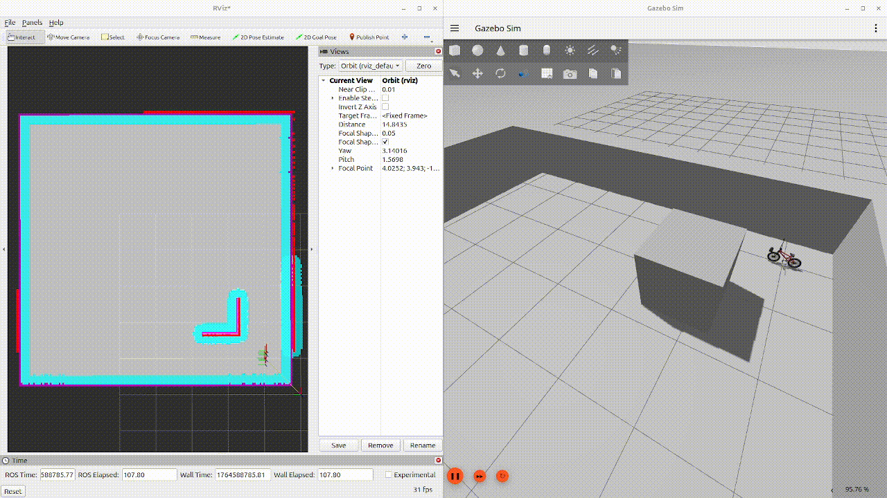
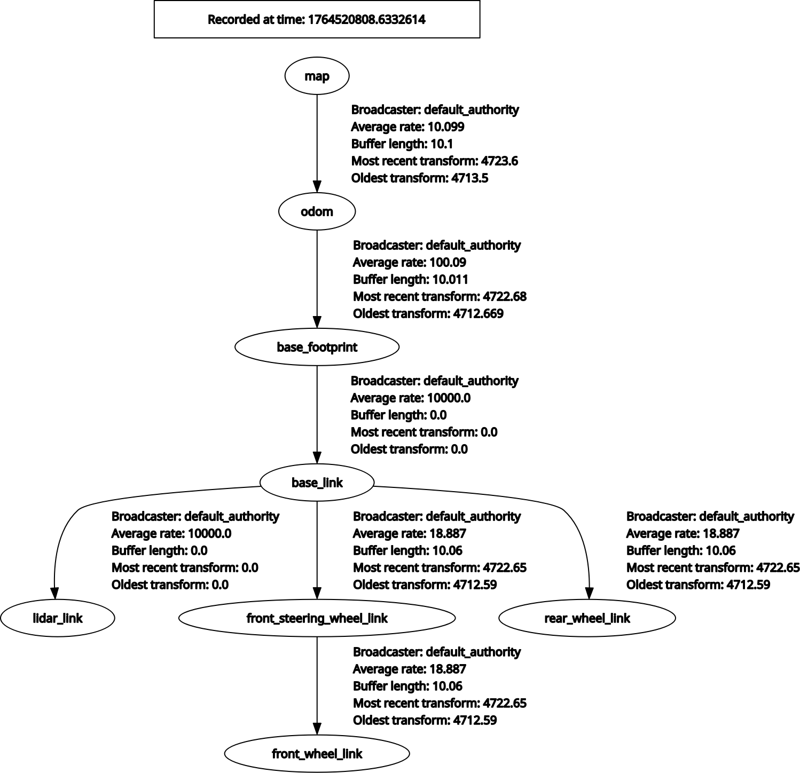

# Robot Navigation



## Оглавление
- [Создание проекта](#создание-проекта)
- [Настройка локализации](#настройка-локализации)
    - [Настройка конфигурации](#настройка-конфигурации)
- [Настройка планирования пути](#настройка-навигации)
- [Настройка CMakeLists.txt](#настройка-cmakeliststxt)
- [Запуск!](#запуск)
    - [Запуск модуля локализации](#запуск-модуля-локализации)
    - [Запуск модуля навигации](#запуск-модуля-навигации)
    - [Задание цели роботу](#задание-цели-роботу)

## Создание проекта

Создадим пакет для работы пакетом навигации Nav2
```
cd ~/nav_ws/src
ros2 pkg create --build-type ament_cmake bmx_navigation
```

Удалим директории для хранения исходного кода и добавим папки **config** для хранения конфигураций, **launch** для хранения файлов запуска и **maps** для хранения карт: 

```
bmx_gazebo/
├── config/
├── launch/
├── maps/
├── CMakeLists.txt
└── package.xml
```

## Настройка локализации

Для работы навигации роботу необходимо знать свое местоположение на карте. Это достигается путем выполнения а) одновременной локализации и картографирования (SLAM) или б) локализации робота на известной карте. Ниже мы будем выполнять настройку локализации на известной карте.

Для настройки локализации необходимы два компоненты: *карта* и *алгоритм* локализации робота на ней. Будем использовать стандартный загрузчик карт map_server и алгоритм локализации AMCL.

Создадим в папке *launch* файл **localization.launch.py**, который и будет отвечать за запуск локализации. Пока сделаем его пустым.

```python
from launch import LaunchDescription

def generate_launch_description():

    ld = LaunchDescription()

    return ld
```

Для локализации нам необходимо знать карту, поэтому укажем в параметрах путь до карты. Также укажем пространство имен, поскольку нам нужно будет запускать уникальные узлы, и укажем флаг использования виртуального времени.

Будем использовать готовую карту из директории [materials](materials/) этого туториала. Папку *empty* скопируем в папку *maps* проекта навигации. Укажем для значения пути до карты по умолчанию *{project}/maps/empty/empty.yaml*.


```python
from launch import LaunchDescription
from launch.substitutions import LaunchConfiguration
from launch.actions import DeclareLaunchArgument
from ament_index_python.packages import get_package_share_directory

import os

def generate_launch_description():

    namespace = LaunchConfiguration('namespace')
    use_sim_time = LaunchConfiguration('use_sim_time')
    map_file = LaunchConfiguration('map')

    declare_namespace_cmd = DeclareLaunchArgument(
        name='namespace',
        default_value='bmx',
        description='Top-level namespace'
    )

    declare_use_sim_time_cmd = DeclareLaunchArgument(
        name='use_sim_time',
        default_value='true',
        description='Use simulation (Gazebo) clock if true'
    )

    declare_map_file_cmd = DeclareLaunchArgument(
        name='map',
        default_value=os.path.join(get_package_share_directory("bmx_navigation"), "maps", "empty", "empty.yaml"),
        description='Full path to map yaml file to load'
    )

    ld = LaunchDescription()

    ld.add_action(declare_namespace_cmd)
    ld.add_action(declare_use_sim_time_cmd)
    ld.add_action(declare_map_file_cmd)

    return ld
```

Добавим узел загрузчика карт [map_server](https://docs.ros.org/en/jazzy/p/nav2_map_server/), указав [параметр пути до YAML-файла карты](https://docs.nav2.org/configuration/packages/map_server/configuring-map-server.html), область имен и ремапинги.

```python
...
from launch_ros.actions import Node

def generate_launch_description():

    ...

    map_server_cmd = Node(
        package='nav2_map_server',
        executable='map_server',
        name='map_server',
        output='screen',
        namespace=namespace,
        parameters=[{
            'use_sim_time': use_sim_time,
            'yaml_filename': map_file,
            'topic_name': "map"
        }],
        arguments=[],
        remappings=[('/tf','tf'),
                    ('/tf_static','tf_static')],
    )

    ld = LaunchDescription()

    ...

    ld.add_action(map_server_cmd)

    return ld
```

Для работы загрузчика необходимо также добавить узел жизненного цикла. В узле необходимо указать флаг автозапуска жизненного цикла и массив из узлов, которые контролирует узел жизненного цикла.

```python
...

def generate_launch_description():

    ...

    lifecycle_manager_cmd = Node(
        package='nav2_lifecycle_manager',
        executable='lifecycle_manager',
        name='lifecycle_manager_localization',
        output='screen',
        namespace=namespace,
        arguments=[],
        parameters=[{
            'autostart': True, 
            'node_names': ['map_server']
        }],
    )

    ld = LaunchDescription()

    ...

    ld.add_action(lifecycle_manager_cmd)

    return ld
```

> Перед дальнейшей реализацией проверьте работу узлов жизненного цикла и загрузки карт. Для этого запустите робота и контроллеры, затем рассматриваемый launch-файл, после чего откройте RViz с указанием ремапинга tf-топиков: ```ros2 run rviz2 rviz2 --ros-args -r /tf:=/bmx/tf -r /tf_static:=/bmx/tf_static```. Укажите глобальный фрейм *map*, в параметрах топика */bmx/map* укажите Durability Policy равным *Transient local* (см. [как работают политики QoS в ROS](https://docs.ros.org/en/jazzy/Concepts/Intermediate/About-Quality-of-Service-Settings.html))

Следующим шагом определим сам узел [локализации](https://docs.nav2.org/configuration/packages/configuring-amcl.html). Укажем топик сканов дальномера, топик карты и начальную точку, в которой должен находиться робот на карте. Выполним также ремап tf-топиков. Добавим выполнение узла перед выполнением узла жизненного цикла.

```python
...

def generate_launch_description():

    ...

    amcl_cmd = Node(
        package='nav2_amcl',
        executable='amcl',
        name='amcl',
        output='screen',
        namespace=namespace,
        parameters=[{
            'scan_topic': "scan", 
            'map_topic': "map",
            'set_initial_pose': True,
            'initial_pose': {"x": 1.0, "y": 1.0}
        }],
        arguments=[],
        remappings=[('/tf','tf'),
                    ('/tf_static','tf_static')],
    )

    ld = LaunchDescription()

    ...
    ld.add_action(amcl_cmd)
    ld.add_action(lifecycle_manager_cmd)

    return ld
```

Перед запуском локализации необходимо поменять виртуальный мир (на мир, который соответствует нашей карте) и место спавна робота. Для этого скопируем виртуальный мир empty.world из папки [materials](materials/) в *bmx_gazebo/worlds*. При запуске Gazebo будем указывать новый *world_path* и параметры *x*, *y* (см. главу ["Запуск"](#запуск)).

> Проверьте работу локализации, управляя роботом через телеоперацию: ```ros2 run teleop_twist_keyboard teleop_twist_keyboard --ros-args -r /cmd_vel:=/bmx/bicycle_steering_controller/reference -p stamped:=true``` 

### Настройка конфигурации

Задавать параметры в самом launch-файле непрактично, поскольку при переносе конфигурации каждый раз необходимо редактировать launch-файл. Отсюда возникает необходимость определения отдельного общего файла конфигурации и его загрузка.

Одним из наиболее удачных подходов является определение параметров в yaml-файле. Попробуем заполнить свой такой файл и задать его в виде массива параметров в файле запуска. Для этого создадим в папке *config* файл **localization.yaml**. Пропишем параметры загрузчика карт, для этого укажем тег *map_server* (название узла ROS) и дочерний тег *ros__parameters*. Внутри него будем указывать все остальные параметры, относящиеся к узлу.
```yaml
map_server:
    ros__parameters:
        yaml_filename: $(find-pkg-share bmx_navigation)/maps/empty/empty.yaml
        use_sim_time: True
        topic_name: map
```

То же сделаем для узла жизненного цикла, указав также остальные параметры по умолчанию.

```yaml
lifecycle_manager_localization:
    ros__parameters:
        autostart: true
        node_names: ['map_server', 'amcl']
        bond_timeout: 4.0
        attempt_respawn_reconnection: true
        bond_respawn_max_duration: 10.0
```

Укажем параметры для узла AMCL, также дополнив его всеми параметрами по умолчанию (параметры берем из [примера Nav2](https://docs.nav2.org/configuration/packages/configuring-amcl.html#example)).

```yaml
amcl:
    ros__parameters:
        # параметры топиков и tf
        global_frame_id: "map"
        base_frame_id: "base_footprint"
        odom_frame_id: "odom"
        scan_topic: scan
        map_topic: map

        # начальная позиция робота
        set_initial_pose: true
        initial_pose:
            x: 1.0
            y: 1.0
            z: 0.0
            yaw: 0.0

        # параметры алгоритма
        alpha1: 0.2
        alpha2: 0.2
        alpha3: 0.2
        alpha4: 0.2
        alpha5: 0.2
        beam_skip_distance: 0.5
        beam_skip_error_threshold: 0.9
        beam_skip_threshold: 0.3
        do_beamskip: false
        lambda_short: 0.1
        laser_likelihood_max_dist: 2.0
        laser_max_range: 100.0
        laser_min_range: -1.0
        laser_model_type: "likelihood_field"
        max_beams: 60
        max_particles: 2000
        min_particles: 500
        pf_err: 0.05
        pf_z: 0.99
        recovery_alpha_fast: 0.0
        recovery_alpha_slow: 0.0
        resample_interval: 1
        robot_model_type: "nav2_amcl::DifferentialMotionModel"
        save_pose_rate: 0.5
        sigma_hit: 0.2
        tf_broadcast: true
        transform_tolerance: 1.0
        update_min_a: 0.2
        update_min_d: 0.25
        z_hit: 0.5
        z_max: 0.05
        z_rand: 0.5
        z_short: 0.05
        always_reset_initial_pose: false
        first_map_only: false
```

Необходимо указать в launch-файле путь до yaml-файла и загрузить его для всех узлов. Добавим в файл запуск параметр пути до yaml-файла и укажем значение по умолчанию.

```python
from launch import LaunchDescription
from launch.substitutions import LaunchConfiguration
from launch.actions import DeclareLaunchArgument
from ament_index_python.packages import get_package_share_directory

import os

def generate_launch_description():

    ...
    params_file = LaunchConfiguration('params_file')

    ...
    declare_params_file_cmd = DeclareLaunchArgument(
        name='params_file',
        default_value=os.path.join(get_package_share_directory("bmx_navigation"), "config", "localization.yaml"),
        description='Localization pamareters in yaml file to load'
    )

    ...
    ld.add_action(declare_params_file_cmd)

    return ld
```

Поскольку все названия узлов будут иметь префикс пространства имен (/amcl -> /bmx/amcl, /map_server -> /bmx/map_server), то нам нужно переименовать наши теги в yaml-файле. Для удобства сделаем это не вручную в самом файле, а программно с помощью класса RewrittenYaml. Для его работы укажем путь до файла, и название пространства имен, которое нужно добавить по всем родительским тегам в файле. Этот объект будем оборачивать в объект ParameterFile, который и будет читать yaml-файл.

```python
...
from launch_ros.descriptions import ParameterFile
from nav2_common.launch import RewrittenYaml

def generate_launch_description():

    ...
    params_file = LaunchConfiguration('params_file')
    
    configured_params = ParameterFile(
        RewrittenYaml(
            source_file=params_file,
            root_key=namespace,
            param_rewrites={},
            convert_types=True,
        ),
        allow_substs=True,
    )

    ...
```

Теперь укажем объект **configured_params** вместо параметров. Оставим параметр пути до файла карты, поскольку нам удобнее его задавать через файл запуска.

```python
...
def generate_launch_description():

    ...
    map_server_cmd = Node(
        package='nav2_map_server',
        executable='map_server',
        name='map_server',
        output='screen',
        namespace=namespace,
        parameters=[configured_params, {'yaml_filename': map_file}],
        arguments=[],
        remappings=[('/tf','tf'),
                    ('/tf_static','tf_static')],
    )

    lifecycle_manager_cmd = Node(
        package='nav2_lifecycle_manager',
        executable='lifecycle_manager',
        name='lifecycle_manager_localization',
        output='screen',
        namespace=namespace,
        arguments=[],
        parameters=[configured_params],
    )

    amcl_cmd = Node(
        package='nav2_amcl',
        executable='amcl',
        name='amcl',
        output='screen',
        namespace=namespace,
        parameters=[configured_params],
        arguments=[],
        remappings=[('/tf','tf'),
                    ('/tf_static','tf_static')],
    )
    ...
```

## Настройка навигации

Для автономной навигации робота на известной карте выполним настройку и запуск всех необходимых компонентов:
- Сервер дерева поведения [*bt_navigator*](https://docs.nav2.org/configuration/packages/configuring-bt-navigator.html)
- Локальный планировщик [*controller_server*](https://docs.nav2.org/configuration/packages/configuring-controller-server.html)
- Локальная карта затрат [*local_costmap*](https://docs.nav2.org/configuration/packages/configuring-costmaps.html)
- Глобальный планировщик [*planner_server*](https://docs.nav2.org/configuration/packages/configuring-planner-server.html)
- Глобальная карта затрат [*global_costmap*](https://docs.nav2.org/configuration/packages/configuring-costmaps.html)
- Сервер восстановления [*behavior_server*](https://docs.nav2.org/configuration/packages/configuring-behavior-server.html)

Создадим в папке *launch* файл **navigation.launch.py** и определим стандартную функцию генерации описания запуска ROS.

```python
from launch import LaunchDescription

def generate_launch_description():

    ld = LaunchDescription()

    return ld
```

Будем сразу определять значения параметров в yaml-файле, поэтому будем передавать в launch-файл аргумент params_file, равный по умолчанию *{project}/config/navigation.yaml*. Сразу будем читать этот файл с помощью RewrittenYaml. Также определим аргумент пространства имен. 

```python
from launch import LaunchDescription
from launch.substitutions import LaunchConfiguration
from launch.actions import DeclareLaunchArgument
from ament_index_python.packages import get_package_share_directory
from launch_ros.descriptions import ParameterFile
from nav2_common.launch import RewrittenYaml

import os

def generate_launch_description():

    namespace = LaunchConfiguration('namespace')
    params_file = LaunchConfiguration('params_file')
    
    configured_params = ParameterFile(
        RewrittenYaml(
            source_file=params_file,
            root_key=namespace,
            param_rewrites={},
            convert_types=True,
        ),
        allow_substs=True,
    )

    declare_namespace_cmd = DeclareLaunchArgument(
        name='namespace',
        default_value='bmx',
        description='Top-level namespace'
    )

    declare_params_file_cmd = DeclareLaunchArgument(
        name='params_file',
        default_value=os.path.join(get_package_share_directory("bmx_navigation"), "config", "navigation.yaml"),
        description='Localization pamareters in yaml file to load'
    )

    ld = LaunchDescription()

    ld.add_action(declare_namespace_cmd)
    ld.add_action(declare_params_file_cmd)

    return ld
```

Создадим узел для BT-навигатора. Поскольку все узлы будут иметь похожие ремапинги, зададим ремапинг как отдельную переменную и будем указывать эту переменную в качестве аргумента.

```python
...
from launch_ros.actions import Node

def generate_launch_description():

    ...

    remappings = [('/tf', 'tf'), ('/tf_static', 'tf_static')]

    bt_navigator_cmd = Node(
        package='nav2_bt_navigator',
        executable='bt_navigator',
        name='bt_navigator',
        output='screen',
        namespace=namespace,
        parameters=[configured_params],
        arguments=[],
        remappings=remappings,
    )

    ...
    ld.add_action(bt_navigator_cmd)

    return ld
```
Настроим параметры навигатора. Для этого создадим в папке *config* файл **navigation.yaml** и пропишем параметры.
```yaml
bt_navigator:
  ros__parameters:
    use_sim_time: True
    global_frame: map
    robot_base_frame: base_footprint
    odom_topic: <robot_namespace>/odom
    transform_tolerance: 0.1
    bt_loop_duration: 10
    default_server_timeout: 20
    wait_for_service_timeout: 1000
    action_server_result_timeout: 900.0
    navigators: ["navigate_to_pose"]
    navigate_to_pose:
      plugin: nav2_bt_navigator::NavigateToPoseNavigator
```

Для замены ключевых слов в YAML-файле будем использовать объект ReplaceString, предварительно передав в него путь до файла конфигурации.

```python
...
from nav2_common.launch import ReplaceString

def generate_launch_description():

    namespace = LaunchConfiguration('namespace')
    params_file = LaunchConfiguration('params_file')

    params_file = ReplaceString(
        source_file=params_file,
        replacements={'<robot_namespace>': ('/', namespace)}
    )

    configured_params = ParameterFile(
        RewrittenYaml(
            source_file=params_file,
            root_key=namespace,
            param_rewrites={},
            convert_types=True,
        ),
        allow_substs=True,
    )

    ...
 
```

Для работы навигатора необходимо определить узел жизненного цикла. Сделаем это аналогично настройкам файла запуска локализации.

```python
...
from launch_ros.actions import Node

def generate_launch_description():

    ...

    lifecycle_manager_cmd = Node(
        package='nav2_lifecycle_manager',
        executable='lifecycle_manager',
        name='lifecycle_manager_navigation',
        output='screen',
        namespace=namespace,
        arguments=[],
        parameters=[configured_params],
    )

    ...
    ld.add_action(lifecycle_manager_cmd)

    return ld
```

В yaml-файле **navigation.yaml** пропишем:

```yaml
lifecycle_manager_navigation:
    ros__parameters:
        use_sim_time: True
        autostart: true
        node_names: ['bt_navigator']
        bond_timeout: 4.0
        attempt_respawn_reconnection: true
        bond_respawn_max_duration: 10.0
```

> Попробуйте запустить навигацию. В случае правильного заполнения конфигураций и launch-файла у вас появится сообщение о том, что сервер действий *compute_path_to_pose* недоступен.

Добавим глобальный планировщик пути для робота. Будем запускать планировщик перед узлом жизненного цикла.

```python
...
from launch_ros.actions import Node

def generate_launch_description():

    ...

    planner_cmd = Node(
        package='nav2_planner',
        executable='planner_server',
        name='planner_server',
        output='screen',
        namespace=namespace,
        parameters=[configured_params],
        arguments=[],
        remappings=remappings,
    )

    ...
    ld.add_action(planner_cmd)
    ld.add_action(lifecycle_manager_cmd)

    return ld
```

В yaml-файле зададим основные настройки глобального планировщика.

```yaml
planner_server:
    ros__parameters:
        use_sim_time: True
        expected_planner_frequency: 20.0
        planner_plugins: ["GridBased"]
        GridBased:
          plugin: nav2_navfn_planner::NavfnPlanner
          tolerance: 0.5
          use_astar: false
          allow_unknown: true
```

Добавим также имя узла в узел жизненного цикла:
```yaml
lifecycle_manager_navigation:
    ros__parameters:
        use_sim_time: True
        autostart: true
        node_names: ['bt_navigator', 'planner_server']
        ...
```

> Попробуйте запустить навигацию. В случае правильного заполнения конфигураций и launch-файла у вас появится сообщение о том, что сервер действий *follow_path* недоступен.

Выполним настройку глобальной карты затрат. Будем использовать три слоя - слой препятствий, статический слой и инфляционный слой. Укажем радиус робота как половину длины робота. Параметры добавим также в **navigation.yaml**.

```yaml
global_costmap:
  global_costmap:
    ros__parameters:
      footprint_padding: 0.01
      update_frequency: 1.0
      publish_frequency: 1.0
      global_frame: map
      robot_base_frame: base_footprint
      robot_radius: 0.25
      resolution: 0.05
      track_unknown_space: true
      plugins: ["static_layer", "obstacle_layer", "inflation_layer"]
      obstacle_layer:
        plugin: nav2_costmap_2d::ObstacleLayer
        enabled: true
        observation_sources: scan
        footprint_clearing_enabled: true
        combination_method: 1
        scan:
          topic: <robot_namespace>/scan
          obstacle_max_range: 2.5
          obstacle_min_range: 0.0
          raytrace_max_range: 3.0
          raytrace_min_range: 0.0
          max_obstacle_height: 2.0
          min_obstacle_height: 0.0
          clearing: True
          marking: True
          data_type: LaserScan
          inf_is_valid: false
      inflation_layer:
        plugin: nav2_costmap_2d::InflationLayer
        enabled: true
        inflation_radius: 0.25
        cost_scaling_factor: 1.0
        inflate_unknown: false
        inflate_around_unknown: true
      static_layer:
        plugin: nav2_costmap_2d::StaticLayer
        enabled: true
        map_subscribe_transient_local: true
        subscribe_to_updates: true
        transform_tolerance: 0.1
      always_send_full_costmap: true
```

Перейдем к добавлению локального планировщика пути. Поскольку по умолчанию этот модуль публикует скорость в /{namespace}/cmd_vel, выполним дополнительный ремаппинг в /{namespace}/bicycle_steering_controller/reference.

```python
...
from launch_ros.actions import Node

def generate_launch_description():

    ...

    controller_cmd = Node(
        package='nav2_controller',
        executable='controller_server',
        name='controller_server',
        output='screen',
        namespace=namespace,
        parameters=[configured_params],
        arguments=[],
        remappings=remappings + [('cmd_vel', 'bicycle_steering_controller/reference')],
    )


    ...
    ld.add_action(controller_cmd)
    ld.add_action(lifecycle_manager_cmd)

    return ld
```
Аналогично параметры добавим в файл **navigation.yaml**. Будем использовать [DWB](https://docs.nav2.org/configuration/packages/configuring-dwb-controller.html) алгоритм и базовые алгоритмы проверки движения робота и проверки достижения целевой позиции роботом.

```yaml
controller_server:
    ros__parameters:
      enable_stamped_cmd_vel: true # для публикации TwistStamped
      use_sim_time: True
      controller_frequency: 20.0
      min_x_velocity_threshold: 0.001
      min_y_velocity_threshold: 0.001
      min_theta_velocity_threshold: 0.001
      failure_tolerance: 0.3
      odom_topic: <robot_namespace>/odom
      progress_checker_plugins: ["progress_checker"]
      goal_checker_plugins: ["goal_checker"]
      controller_plugins: ["FollowPath"]
      use_realtime_priority: false
      progress_checker:
        plugin: nav2_controller::SimpleProgressChecker
        required_movement_radius: 0.5
        movement_time_allowance: 10.0
      goal_checker:
        plugin: "nav2_controller::SimpleGoalChecker"
        xy_goal_tolerance: 0.25
        yaw_goal_tolerance: 3.14
        stateful: True
      FollowPath:
        plugin: "dwb_core::DWBLocalPlanner"
```

Теперь выполним настройку локального планировщика. Для этого укажем основные параметры:
- минимальные и максимальные скорости по осям X, Y и оси вращения Z
- минимальные и максимальные значения ускорения и торможения робота
- параметры для генерации скоростей: размер выборки скоростей по всем осям
- горизонт планирования и шаг планирования
- параметры критиков (коэффициенты оптимизации)

```yaml
controller_server:
    ros__parameters:
      ...
      FollowPath:
        plugin: "dwb_core::DWBLocalPlanner"
        debug_trajectory_details: True
        
        # минимальные и максимальные скорости по осям X, Y и оси вращения Z
        min_vel_x: -0.3
        min_vel_y: -0.3
        max_vel_x: 0.3
        max_vel_y: 0.3
        max_vel_theta: 1.0
        min_speed_xy: -0.3
        max_speed_xy: 0.3
        min_speed_theta: 0.0

        # минимальные и максимальные значения ускорения и торможения робота
        acc_lim_x: 2.5
        acc_lim_y: 0.0
        acc_lim_theta: 3.2
        decel_lim_x: -2.5
        decel_lim_y: 0.0
        decel_lim_theta: -3.2

        # параметры для генерации скоростей: размер выборки скоростей по всем осям
        vx_samples: 20
        vy_samples: 5
        vtheta_samples: 20

        # горизонт планирования и шаг планирования
        sim_time: 1.7
        linear_granularity: 0.05
        angular_granularity: 0.025
        transform_tolerance: 0.2

        # 
        xy_goal_tolerance: 0.25
        trans_stopped_velocity: 0.25
        short_circuit_trajectory_evaluation: True
        
        # параметры критиков
        critics: ["RotateToGoal", "Oscillation", "BaseObstacle", "GoalAlign", "PathAlign", "PathDist", "GoalDist"]
        BaseObstacle.scale: 0.02
        PathAlign.scale: 32.0
        GoalAlign.scale: 24.0
        PathAlign.forward_point_distance: 0.1
        GoalAlign.forward_point_distance: 0.1
        PathDist.scale: 32.0
        GoalDist.scale: 24.0
        RotateToGoal.scale: 32.0
        RotateToGoal.slowing_factor: 5.0
        RotateToGoal.lookahead_time: -1.0
```

Добавим имя узла в узел жизненного цикла:
```yaml
lifecycle_manager_navigation:
    ros__parameters:
        use_sim_time: True
        autostart: true
        node_names: ['bt_navigator', 'planner_server', 'controller_server']
        ...
```

> В случае правильного заполнения конфигураций и launch-файла при запуске у вас появится сообщение о том, что сервер действий *spin* недоступен.

Выполним настройку локальной карты затрат. Будем использовать два слоя - слой препятствий и инфляционный слой. Укажем радиус робота как половину длины робота. Параметры добавим также в **navigation.yaml**.

```yaml
local_costmap:
  local_costmap:
    ros__parameters:
      update_frequency: 5.0
      publish_frequency: 2.0
      global_frame: odom
      robot_base_frame: base_footprint
      rolling_window: true
      width: 6
      height: 6
      robot_radius: 0.25
      resolution: 0.05
      plugins: ["obstacle_layer", "inflation_layer"]
      obstacle_layer:
        plugin: nav2_costmap_2d::ObstacleLayer
        enabled: true
        observation_sources: scan
        footprint_clearing_enabled: true
        combination_method: 1
        scan:
          topic: <robot_namespace>/scan
          obstacle_max_range: 2.5
          obstacle_min_range: 0.0
          raytrace_max_range: 3.0
          raytrace_min_range: 0.0
          max_obstacle_height: 2.0
          min_obstacle_height: 0.0
          clearing: true
          marking: true
          data_type: LaserScan
          inf_is_valid: false
      inflation_layer:
        plugin: nav2_costmap_2d::InflationLayer
        enabled: true
        inflation_radius: 0.25
        cost_scaling_factor: 1.0
        inflate_unknown: false
        inflate_around_unknown: true
      always_send_full_costmap: true
```

Теперь добавим сервер поведения в наш файл запуска. Поскольку по умолчанию этот модуль публикует скорость в /{namespace}/cmd_vel, выполним дополнительный ремаппинг в /{namespace}/bicycle_steering_controller/reference.

```python
...
from launch_ros.actions import Node

def generate_launch_description():

    ...

    behavior_cmd = Node(
        package='nav2_behaviors',
        executable='behavior_server',
        name='behavior_server',
        output='screen',
        namespace=namespace,
        parameters=[configured_params],
        arguments=[],
        remappings=remappings + [('cmd_vel', 'bicycle_steering_controller/reference')],
    )


    ...
    ld.add_action(behavior_cmd)
    ld.add_action(lifecycle_manager_cmd)

    return ld
```

В файл **navigation.yaml** добавим параметры [Behavior Server](https://docs.nav2.org/configuration/packages/configuring-behavior-server.html). Будем использовать поворот (Spin), задний ход (BackUp) и ожидание (Wait). 

```yaml
behavior_server:
    ros__parameters:
      enable_stamped_cmd_vel: true # для публикации TwistStamped
      use_sim_time: True
      local_costmap_topic: local_costmap/costmap_raw
      global_costmap_topic: global_costmap/costmap_raw
      local_footprint_topic: local_costmap/published_footprint
      global_footprint_topic: global_costmap/published_footprint
      cycle_frequency: 10.0
      behavior_plugins: ["spin", "backup", "wait"]
      spin:
        plugin: nav2_behaviors::Spin
      backup:
        plugin: nav2_behaviors::BackUp
      wait:
        plugin: nav2_behaviors::Wait
      local_frame: odom
      global_frame: map
      robot_base_frame: base_footprint
      transform_tolerance: 0.1
      simulate_ahead_time: 2.0
      max_rotational_vel: 1.0
      min_rotational_vel: 0.4
      rotational_acc_lim: 3.2
```

Добавим имя узла в узел жизненного цикла:
```yaml
lifecycle_manager_navigation:
    ros__parameters:
        use_sim_time: True
        autostart: true
        node_names: ['bt_navigator', 'planner_server', 'controller_server', 'behavior_server']
        ...
```

Навигация настроена! Теперь необходимо собрать, запустить все файлы запуска и дать цель роботу через RViz!

## Настройка CMakeLists.txt

Настроим CMakeLists.txt, чтобы после сборки проекта были доступны launch-скрипты и файлы мира. Для этого перейдем в CMakeLists.txt и добавим в конец файла следующие строки:

```cmake
cmake_minimum_required(VERSION 3.8)
project(bmx_navigation)

...

install(
  DIRECTORY launch maps config 
  DESTINATION share/${PROJECT_NAME}
)

ament_package()

```

## Запуск!

Предварительно выполним запуск мира Gazebo с роботом:

```bash
ros2 launch bmx_gazebo bmx_gazebo.launch.py x:=1.0 y:=1.0 world_path:=$(ros2 pkg prefix bmx_gazebo)/share/bmx_gazebo/worlds/empty.world
```

### Запуск модуля локализации

Файл запуска готов. Выполняем сборку проекта: ```colcon build```
Запускаем launch-файл локализации, указав пространство имен для терминала.
```bash
source ~/nav_ws/install/setup.bash
ros2 launch bmx_navigation localization.launch.py
```

Проверяем наличие преобразования из фрейма *map* в *odom*:

```bash
ros2 run rqt_tf_tree rqt_tf_tree --ros-args -r /tf:=/bmx/tf -r /tf_static:=/bmx/tf_static
```

Если все пункты туториала выполнены, после запуска модуля мы получим следующий граф трансформаций



### Запуск модуля навигации

В другом терминале запускаем launch-файл навигации:
```bash
source ~/nav_ws/install/setup.bash
ros2 launch bmx_navigation navigation.launch.py
```

В случае каких-либо ошибок в пакетах выполняем дополнительно команды

```bash
sudo apt update
sudo apt upgrade
```

### Задание цели роботу

В новом терминале откроем RViz:

```bash
ros2 run rviz2 rviz2 --ros-args -r /tf:=/bmx/tf -r /tf_static:=/bmx/tf_static
```

Добавим через 'Add' топик карты. Затем сверху выберем '2D Goal Pose', выполним ПКМ, и нажмем на 'Tool Properties'. В открывшемся окне напротив '2D Goal Pose/Topic' напишем имя топика: '/bmx/goal_pose'. Теперь закроем это окно и зададим целевую точку для робота.